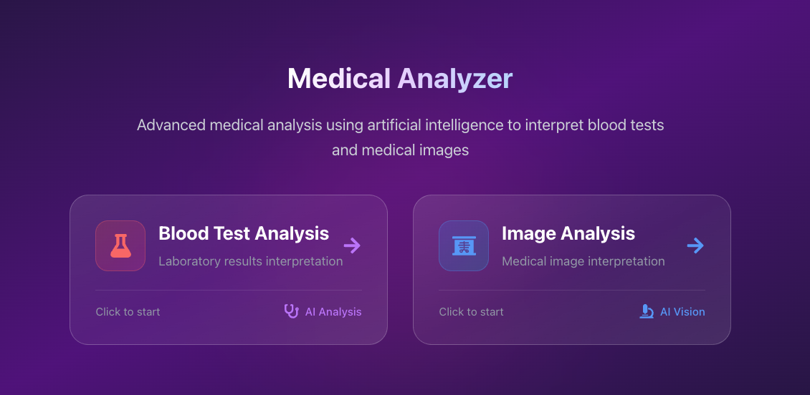
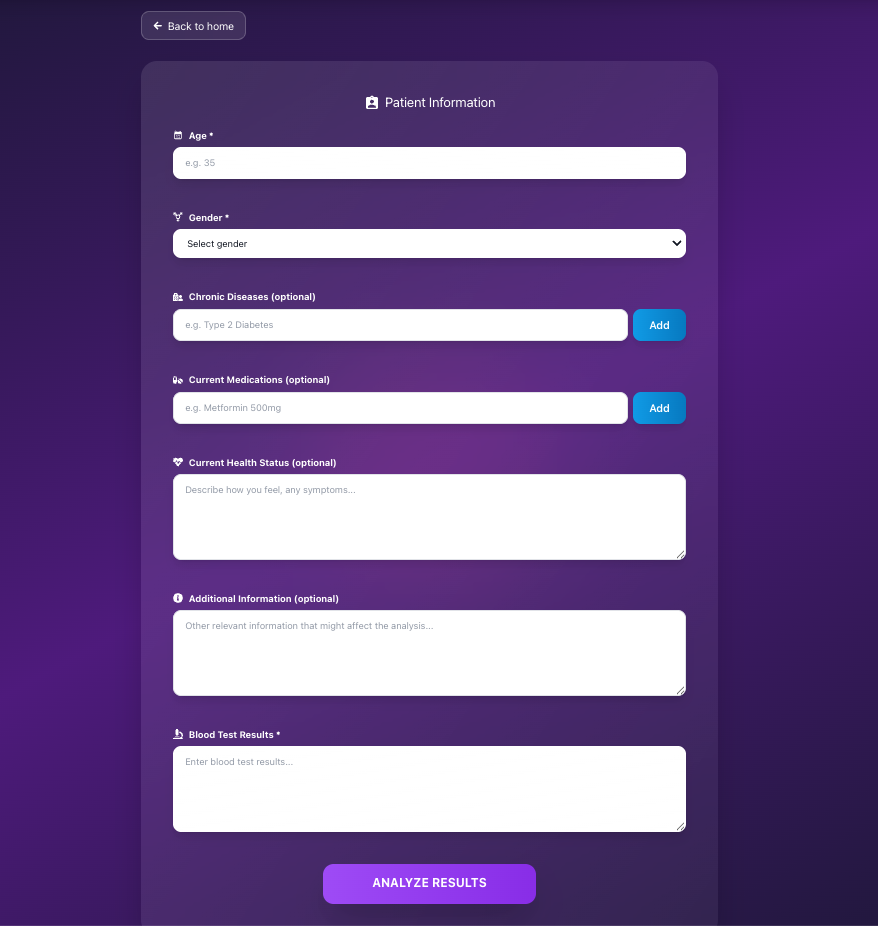
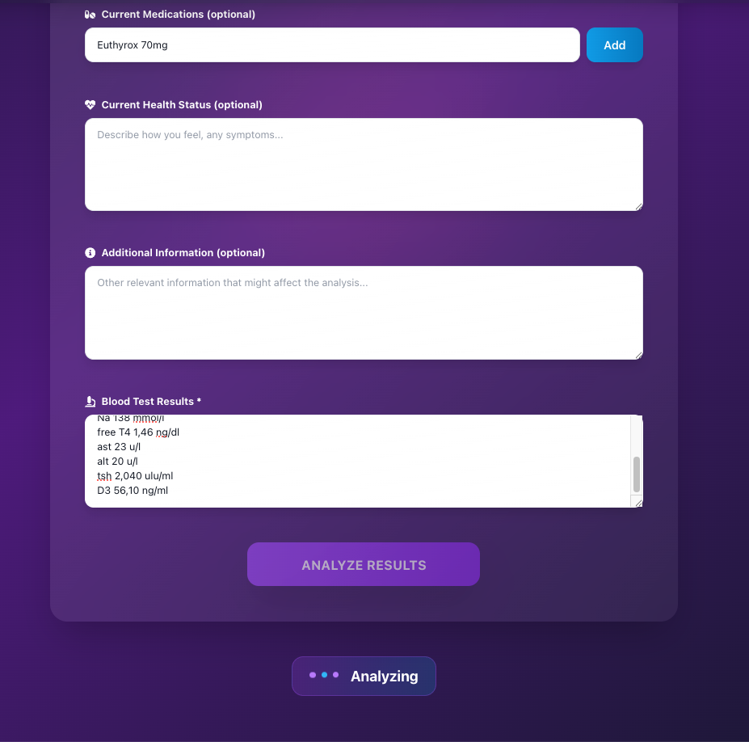
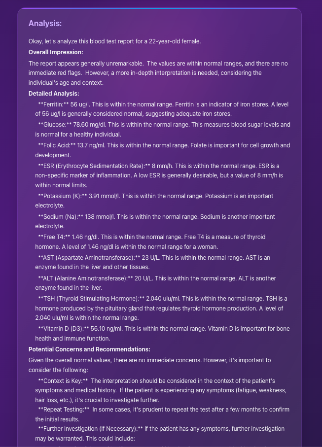
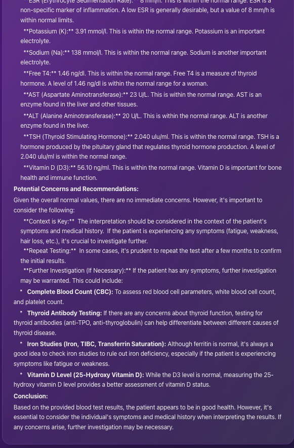
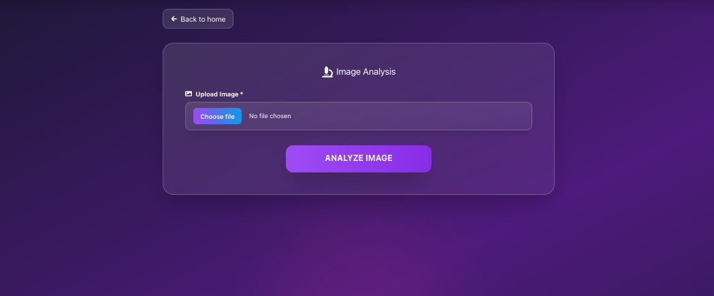
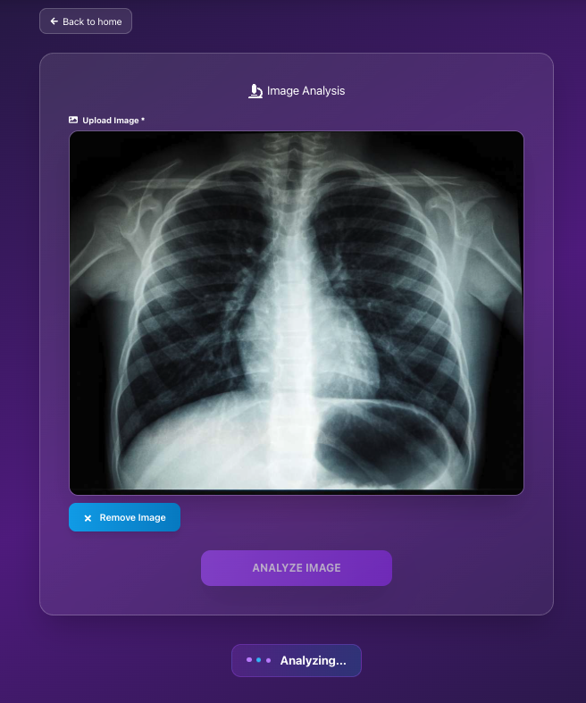

<div align="center">

# 🏥 MedicalAnalyzer

> **AI-Powered Medical Analysis Platform**  
> blood test interpretation and X-ray analysis using specialized MedGemma-4B model

[](https://fastapi.tiangolo.com)
[](https://reactjs.org)
[](https://ollama.com)
[](https://www.docker.com/)
[](https://tailwindcss.com)
[](https://python.org)

</div>

## 🚀 Quick Start

```bash
# Clone repository
git clone https://github.com/00200200/MedicalAnalyzer.git
cd MedicalAnalyzer

# Build and run the application
docker compose build
docker compose up

# Pull the required AI model
docker compose exec ollama ollama pull edwardlo12/medgemma-4b-it-Q4_K_M
```

The application will be available at:

- **Frontend**: `http://localhost:3000`
- **Backend**: `http://localhost:8000`

## 🖥️ Application Showcase

<div align="center">

### 🏠 **Landing Page**



---

### 🩸 **Blood Test Analysis Workflow**

<table>
<tr>
<td align="center" width="50%">
<strong>📝 Input Form</strong><br/>

</td>
<td align="center" width="50%">
<strong>⏳ Processing</strong><br/>

</td>
</tr>
<tr>
<td align="center" width="50%">
<strong>📊 Analysis Results (Part 1)</strong><br/>

</td>
<td align="center" width="50%">
<strong>📈 Analysis Results (Part 2)</strong><br/>

</td>
</tr>
</table>

---

### 🩻 **X-Ray Image Analysis Workflow**

<table>
<tr>
<td align="center" width="50%">
<strong>📤 Image Upload</strong><br/>

</td>
<td align="center" width="50%">
<strong>🔍 Processing</strong><br/>

</td>
</tr>
<tr>
<td align="center" colspan="2">
<strong>📋 Analysis Results</strong><br/>

</td>
</tr>
</table>

</div>

## 🧠 How it Works

The application uses a specialized medical AI model (MedGemma-4B) to provide:

- **Blood Test Analysis**
- **X-Ray Image Analysis**

## 📡 API Endpoints

| Endpoint                 | Method | Description                |
| ------------------------ | ------ | -------------------------- |
| `/analyze_blood_results` | POST   | Analyze blood test results |
| `/analyze_image`         | POST   | Analyze X-ray images       |

## 📁 Project Structure

```
MedicalAnalyzer/
├── docker-compose.yml
├── docs/                    # Screenshots
├── backend/                 # FastAPI Backend
│   ├── Dockerfile
│   ├── requirements.txt
│   ├── main.py
│   └── src/model/llm.py
└── frontend/               # React Frontend
    ├── Dockerfile
    ├── package.json
    ├── tailwind.config.js
    ├── public/
    └── src/
        ├── App.jsx
        ├── index.jsx
        ├── index.css
        └── components/
            ├── LandingPage.jsx
            ├── Home.jsx
            ├── ImageAnalyzer.jsx
            ├── Form.jsx
            ├── formatAnalysis.jsx
            ├── Header.jsx
            └── Footer.jsx
```

## 🛠️ Technology Stack

- **Frontend**: React 18, TailwindCSS, Axios
- **Backend**: FastAPI, Python 3.11+, Pydantic
- **AI Engine**: Ollama, MedGemma-4B
- **Infrastructure**: Docker, Docker Compose


## ⚠️ Disclaimer

This application is for **educational and demonstration purposes only**. It does not replace professional medical consultation. Always consult results with a doctor.

---

**PL**: Projekt na zaliczenie przedmiotu "Projektowanie systemów informatyki medycznej"
